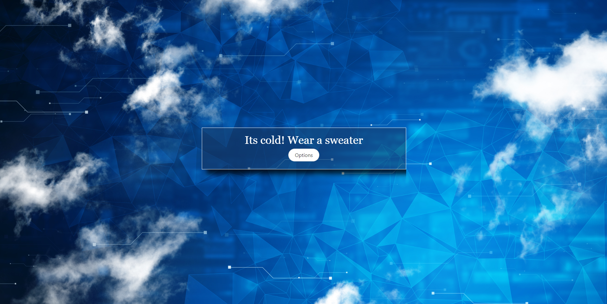

# Do I need a Jacket

## Description
simple webapp that tells you if you should wear a jacket or sweater based off the current conditions of the weather.

## Table of Contents
- [Features](#features)
- [Future](#future)
- [Notes](#notes)
- [Live-site](#live-site)
- [Screenshot](#screenshot)
- [Credits](#credits)
- [License](#license)

## Features:

- Options to select temperature breakpoints for jacket and sweater usage 
- Options stored in local storage
- Easy to use (no input needed for application to run)
- Zipcode is pulled from ip address infromation
- Current weather conditions pulled from acuweather api engine

## Future:

- "R" rated text for weather conditions
- move to native desktop app
- use bulma modal containers for options

## Notes
- these api are free thus have a limited amout of calls they can do.
- weather API calls are limited to 50 
(25 page refreshes) per day
- ipaddress api calls are limited to 1 request per second

## Live-site

[You can find the site at live here on github](https://attidack.github.io/weather-thoughts/)

## Screenshot

## Credits

The original idea came from an old desktop modding enviorment called [rainmeter](https://www.rainmeter.net/).  Rainmeter had a plug in called [Do I need a jacket](https://visualskins.com/skin/do-i-need-jacket-2) that stopped working in 2018.  This project is a start to bring that one back to life.

Collab with Cody Eddie and Paul Smith in group 4 at the U of U fullstack bootcamp

## License

MIT License

Copyright (c) [2022] [Jon Bird]

Permission is hereby granted, free of charge, to any person obtaining a copy
of this software and associated documentation files (the "Software"), to deal
in the Software without restriction, including without limitation the rights
to use, copy, modify, merge, publish, distribute, sublicense, and/or sell
copies of the Software, and to permit persons to whom the Software is
furnished to do so, subject to the following conditions:

The above copyright notice and this permission notice shall be included in all
copies or substantial portions of the Software.

THE SOFTWARE IS PROVIDED "AS IS", WITHOUT WARRANTY OF ANY KIND, EXPRESS OR
IMPLIED, INCLUDING BUT NOT LIMITED TO THE WARRANTIES OF MERCHANTABILITY,
FITNESS FOR A PARTICULAR PURPOSE AND NONINFRINGEMENT. IN NO EVENT SHALL THE
AUTHORS OR COPYRIGHT HOLDERS BE LIABLE FOR ANY CLAIM, DAMAGES OR OTHER
LIABILITY, WHETHER IN AN ACTION OF CONTRACT, TORT OR OTHERWISE, ARISING FROM,
OUT OF OR IN CONNECTION WITH THE SOFTWARE OR THE USE OR OTHER DEALINGS IN THE
SOFTWARE.